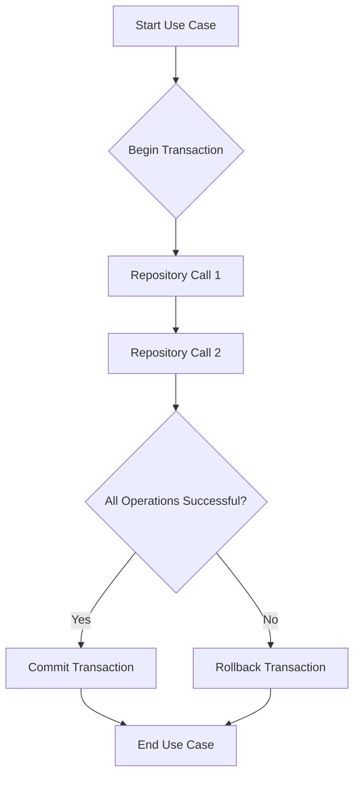

# GORM Integration Strategy

This document outlines the strategy for integrating GORM into the existing backend, replacing `sqlx` for database interactions.

## 1. Passing `*gorm.DB` to Repository Constructors

The current dependency injection pattern, where `*sqlx.DB` is passed to `NewRepository` and subsequently to individual sub-repository constructors, will be maintained. The type will be updated to `*gorm.DB`.

**Example:**

```go
// In main.go or similar setup file
import "gorm.io/gorm"

func setupDatabase() *gorm.DB {
    // ... GORM initialization ...
    return db
}

// In backend/internal/todo/repository/repository.go
type Repository interface {
    // ... existing interfaces ...
}

type repository struct {
    TodoListRepository
    TodoItemRepository
    TodoListCollaboratorRepository
}

func NewRepository(db *gorm.DB) Repository {
    return &repository{
        TodoListRepository:             NewTodoListRepository(db),
        TodoItemRepository:             NewTodoItemRepository(db),
        TodoListCollaboratorRepository: NewTodoListCollaboratorRepository(db),
    }
}

// In backend/internal/todo/repository/todolist_repository.go (example sub-repository)
type todoListRepository struct {
    db *gorm.DB
}

func NewTodoListRepository(db *gorm.DB) TodoListRepository {
    return &todoListRepository{db: db}
}
```

## 2. GORM Model Definition

Existing `entity` structs will be used as GORM models. `db:"column_name"` tags will be replaced or augmented with `gorm:"column:column_name"` tags. For fields like `ID`, `CreatedAt`, and `UpdatedAt` that are already present and follow GORM's conventions, explicit `gorm.Model` embedding is not strictly necessary to avoid redundancy, but `gorm` tags will be added for clarity and to ensure correct mapping.

**Example (from `backend/internal/todo/entity/todo.go`):**

```go
package entity

import (
	"time"
)

// TodoList represents a todo list.
type TodoList struct {
	ID          string    `gorm:"primaryKey;type:uuid;default:gen_random_uuid()" json:"id"`
	Title       string    `gorm:"type:varchar(255);not null" json:"title"`
	Description string    `gorm:"type:text" json:"description"` // Optional
	OwnerID     string    `gorm:"type:uuid;not null" json:"owner_id"`    // ID of the user who owns the list
	CreatedAt   time.Time `gorm:"autoCreateTime" json:"created_at"`
	UpdatedAt   time.Time `gorm:"autoUpdateTime" json:"updated_at"`
}

// TodoItem represents a todo item within a list.
type TodoItem struct {
	ID          string     `gorm:"primaryKey;type:uuid;default:gen_random_uuid()" json:"id"`
	ListID      string     `gorm:"type:uuid;not null" json:"list_id"` // Foreign key to TodoList.ID
	Title       string     `gorm:"type:varchar(255);not null" json:"title"`
	Description string     `gorm:"type:text" json:"description"`
	Deadline    *time.Time `gorm:"type:timestamp with time zone" json:"due_date,omitempty"` // Optional
	Completed   bool       `gorm:"type:boolean;default:false" json:"completed"`
	Position    string     `gorm:"type:varchar(255);not null" json:"position"` // Fractional index position
	CreatedAt   time.Time  `gorm:"autoCreateTime" json:"created_at"`
	UpdatedAt   time.Time  `gorm:"autoUpdateTime" json:"updated_at"`
}

// TodoListCollaborator represents a many-to-many relationship between TodoList and User.
type TodoListCollaborator struct {
	TodoListID     string    `gorm:"primaryKey;type:uuid" json:"todo_list_id"`    // Foreign key to TodoList.ID
	CollaboratorID string    `gorm:"primaryKey;type:uuid" json:"collaborator_id"` // ID of the collaborating user
	CreatedAt      time.Time `gorm:"autoCreateTime" json:"created_at"`
	UpdatedAt      time.Time `gorm:"autoUpdateTime" json:"updated_at"`
}
```

## 3. General Approach for Converting CRUD Operations

CRUD operations will be converted from raw SQL queries to GORM's fluent API.

**Example: TodoItemRepository (Conceptual)**

### Create
**Before (sqlx):**
```go
const insertTodoItemSQL = `INSERT INTO todo_items (id, list_id, title, description, deadline, completed, position, created_at, updated_at) VALUES (:id, :list_id, :title, :description, :deadline, :completed, :position, :created_at, :updated_at)`
_, err := r.db.NamedExecContext(ctx, insertTodoItemSQL, todoItem)
```

**After (GORM):**
```go
func (r *todoItemRepository) CreateTodoItem(ctx context.Context, todoItem *entity.TodoItem) error {
    return r.db.WithContext(ctx).Create(todoItem).Error
}
```

### Read
**Before (sqlx):**
```go
const getTodoItemByIDSQL = `SELECT * FROM todo_items WHERE id = $1`
var todoItem entity.TodoItem
err := r.db.GetContext(ctx, &todoItem, getTodoItemByIDSQL, id)
```

**After (GORM):**
```go
func (r *todoItemRepository) GetTodoItemByID(ctx context.Context, id string) (*entity.TodoItem, error) {
    var todoItem entity.TodoItem
    result := r.db.WithContext(ctx).First(&todoItem, "id = ?", id)
    if result.Error != nil {
        return nil, result.Error
    }
    return &todoItem, nil
}
```

### Update
**Before (sqlx):**
```go
const updateTodoItemSQL = `UPDATE todo_items SET title = :title, description = :description, deadline = :deadline, completed = :completed, position = :position, updated_at = :updated_at WHERE id = :id`
_, err := r.db.NamedExecContext(ctx, updateTodoItemSQL, todoItem)
```

**After (GORM):**
```go
func (r *todoItemRepository) UpdateTodoItem(ctx context.Context, todoItem *entity.TodoItem) error {
    return r.db.WithContext(ctx).Save(todoItem).Error
}
```

### Delete
**Before (sqlx):**
```go
const deleteTodoItemSQL = `DELETE FROM todo_items WHERE id = $1`
_, err := r.db.ExecContext(ctx, deleteTodoItemSQL, id)
```

**After (GORM):**
```go
func (r *todoItemRepository) DeleteTodoItem(ctx context.Context, id string) error {
    return r.db.WithContext(ctx).Delete(&entity.TodoItem{}, "id = ?", id).Error
}
```

## 4. Strategy for Transaction Management

Transaction management will primarily be handled at the use case layer, where business logic might involve multiple repository operations that need to be atomic. GORM's `db.Transaction` method provides a convenient way to manage transactions.

**Example (Conceptual in a Use Case):**

```go
// In backend/internal/todo/usecase/todo_usecase.go
type todoUseCase struct {
    repo repository.Repository
    db   *gorm.DB // GORM DB instance for transaction management
}

func (uc *todoUseCase) CreateTodoListWithItems(ctx context.Context, list *entity.TodoList, items []*entity.TodoItem) error {
    return uc.db.WithContext(ctx).Transaction(func(tx *gorm.DB) error {
        // Use a transactional DB instance for repository calls
        listRepo := repository.NewTodoListRepository(tx)
        itemRepo := repository.NewTodoItemRepository(tx)

        if err := listRepo.CreateTodoList(ctx, list); err != nil {
            return err
        }

        for _, item := range items {
            item.ListID = list.ID
            if err := itemRepo.CreateTodoItem(ctx, item); err != nil {
                return err
            }
        }
        return nil
    })
}
```
**Mermaid Diagram: Transaction Flow**


## 5. Error Handling Strategy

GORM returns standard `error` types. Specific GORM errors, such as `gorm.ErrRecordNotFound`, will be checked and translated into application-specific errors (e.g., `entity.ErrNotFound`) at the repository layer. Other GORM errors will be wrapped or returned directly, allowing higher layers to handle them as appropriate.

**Example:**

```go
func (r *todoItemRepository) GetTodoItemByID(ctx context.Context, id string) (*entity.TodoItem, error) {
    var todoItem entity.TodoItem
    result := r.db.WithContext(ctx).First(&todoItem, "id = ?", id)
    if result.Error != nil {
        if errors.Is(result.Error, gorm.ErrRecordNotFound) {
            return nil, entity.ErrNotFound // Translate to application-specific error
        }
        return nil, fmt.Errorf("failed to get todo item: %w", result.Error) // Wrap other errors
    }
    return &todoItem, nil
}
```

## 6. Timestamp Management

The `CreatedAt` and `UpdatedAt` fields are already defined as `time.Time` in the existing `entity` structs. GORM automatically populates these fields on creation and update, respectively, when they are named `CreatedAt` and `UpdatedAt` and have the `gorm:"autoCreateTime"` and `gorm:"autoUpdateTime"` tags. This aligns perfectly with the current application-layer timestamp management.

**Example (from `backend/internal/todo/entity/todo.go`):**

```go
type TodoList struct {
	// ... other fields ...
	CreatedAt   time.Time `gorm:"autoCreateTime" json:"created_at"`
	UpdatedAt   time.Time `gorm:"autoUpdateTime" json:"updated_at"`
}

type TodoItem struct {
	// ... other fields ...
	CreatedAt   time.Time  `gorm:"autoCreateTime" json:"created_at"`
	UpdatedAt   time.Time  `gorm:"autoUpdateTime" json:"updated_at"`
}

type TodoListCollaborator struct {
	// ... other fields ...
	CreatedAt      time.Time `gorm:"autoCreateTime" json:"created_at"`
	UpdatedAt      time.Time `gorm:"autoUpdateTime" json:"updated_at"`
}
